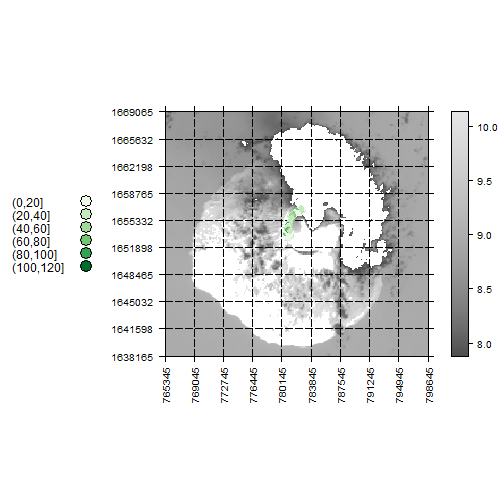

In the first step the necessary libraries are loaded and the working directory is defined. 
In addition the files needed for plotting are read in. 

```r
library(sp)
library(raster)
library(rgdal)
library(RColorBrewer)
library(latticeExtra)

setwd ("C:/Users/Karsten/Dropbox/msc_environmental_geography/semester_1/datamanagement/data")
fogo.rast <- raster("LC82100502014328LGN00_B10.tif")
survey2014 <- readOGR("data_2014_subset1.shp", "data_2014_subset1")
```

```
## OGR data source with driver: ESRI Shapefile 
## Source: "data_2014_subset1.shp", layer: "data_2014_subset1"
## with 161 features and 6 fields
## Feature type: wkbPoint with 2 dimensions
```

```r
survey2014 <- spTransform(survey2014, CRS(projection(fogo.rast)))
```

The following function definies different parameters used for plotting the read in files. 
To plot the function needs a raster, a vector and a number which defines the grid laying over
the map type figure. 


```r
create.map <- function (tif, vector, grid.nmbr){
  vector_classes <- cut(vector@data$COVRG, c(0, 20, 40, 60, 80, 100, 120))
  vector_colors <- colorRampPalette(brewer.pal(6,"Reds"))(6)
  min <- max(mean(getValues(tif)) - sd(getValues(tif)), 0)
  max <- mean(getValues(tif)) + sd(getValues(tif))
  
  breaks <- seq(min, max, length.out = 256)
  
  yat = seq(extent(tif)@ymin, 
            extent(tif)@ymax, length.out = grid.nmbr)
  xat = seq(extent(tif)@xmin, 
            extent(tif)@xmax, length.out = grid.nmbr)
  
  
  plt <- spplot(tif, col.regions = gray.colors(256), at = breaks,
              key = list(space = 'left', text = list(levels(vector_classes)), 
              points = list(pch = 21, cex = 2, fill = vector_colors)),
                colorkey=list(space="right"),
                panel = function(...){
                  panel.levelplot(...)
                  panel.abline(h = yat, v = xat, col = "grey0", lwd = 0.8, lty = 5) 
                },
              scales = list(x = list(at = xat,rot=90),
                            y = list(at = yat)))
  
  orl <- spplot(vector, zcol = "COVRG", col.regions = vector_colors, 
                cuts = c(0, 20, 40, 60, 80, 100, 120))
  
  plt + as.layer(orl)
}
```

In the last step, the above defined function is executed with a raster, a vector and a number 
defining that the grid should appear in 8 sections. This number can be defined randomly. 


```r
create.map(fogo.rast, survey2014, 10)
```

 
